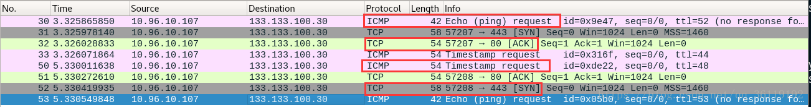
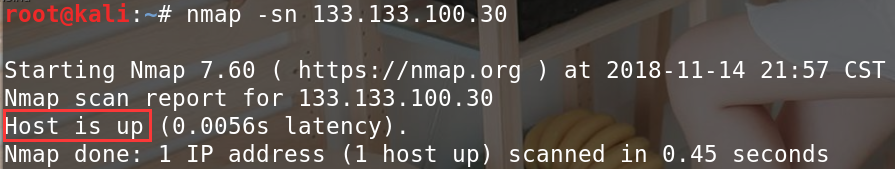
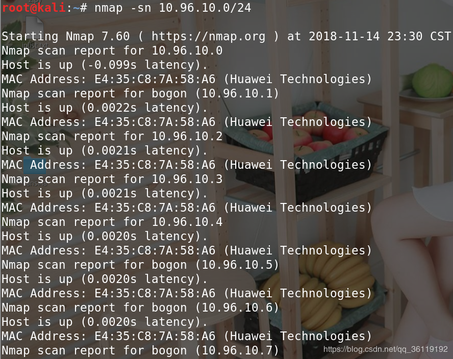

# 一、主机发现

主机发现的原理与Ping命令类似，发送探测包到目标主机，如果收到回复，那么说明目标主机是开启的。Nmap支持十多种不同的主机探测方式，用户可以在不同的条件下灵活选用不同的方式来探测目标机。主机发现常用参数如下。

```text
-sn: Ping Scan 只进行主机发现，不进行端口扫描。
-PE/PP/PM: 使用ICMP echo、 ICMP timestamp、ICMP netmask 请求包发现主机。
-PS/PA/PU/PY[portlist]: 使用TCP SYN/TCP ACK或SCTP INIT/ECHO方式进行发现。 

-sL: List Scan 列表扫描，仅将指定的目标的IP列举出来，不进行主机发现。 
-Pn: 将所有指定的主机视作开启的，跳过主机发现的过程。
-PO[protocollist]: 使用IP协议包探测对方主机是否开启。  
-n/-R: -n表示不进行DNS解析；-R表示总是进行DNS解析。  
--dns-servers <serv1[,serv2],...>: 指定DNS服务器。   
--system-dns: 指定使用系统的DNS服务器   
--traceroute: 追踪每个路由节点 
---------------------
```

## 当探测公网ip时

**nmap -sn**

Nmap会发送四种不同类型的数据包来探测目标主机是否在线。

```text
1.ICMP echo request
2.a TCP SYN packet to port 443(https)
3.a TCP ACK packet to port 80(http)
4.an ICMP timestamp request
```

```text
 例：  nmap  -sn   133.133.100.30
```

  依次发送四个报文探测目标机是否开启。只要收到其中一个包的回复，那就证明目标机开启。使用四种不同类型的数据包可以避免因防火墙或丢包造成的判断错误

通常主机发现并不单独使用，而只是作为端口扫描、版本侦测、OS侦测先行步骤。而在某些特殊应用（例如确定大型局域网内活动主机的数量），可能会单独专门使用主机发现功能来完成。

## 当探测内网ip时

**nmap -sn**

使用 nmap -sn 内网ip 这个命令会发送arp请求包探测目标ip是否在线，如果有arp回复包，则说明在线。此命令可以探测目标主机是否在线，如果在线，还可以得到其MAC地址。但是不会探测其开放的端口号。

**nmap -PE/-PP/-PM**

使用 nmap -PE/PP/PM 内网ip 探测主机的开启情况，使用的是ARP请求报文，如果有ARP回复报文，说明主机在线。-PP/PE/PM命令探测到主机在线后，还会探测主机的端口的开启状态以及运行的服务，其探测端口状态原理在下一节中有介绍。

探测该主机所在网段内所有主机的在线情况，使用的是 nmap -sn 网段/子网掩码 。

```text
例：nmap  -sn  10.96.10.0/24  或  nmap  -sn  10.96.10.100-200
```

探测10.96.10.0 这个网段内主机的在线情况，返回在线主机的ip和MAC地址 

